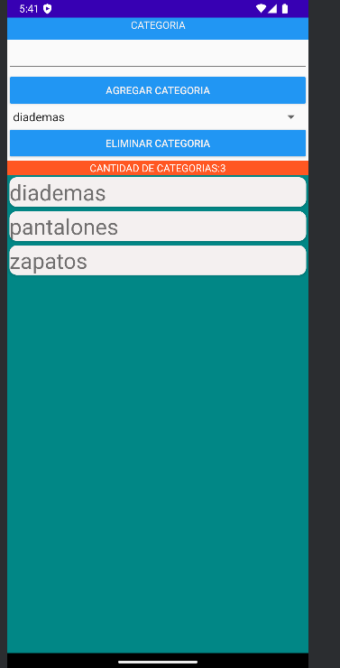
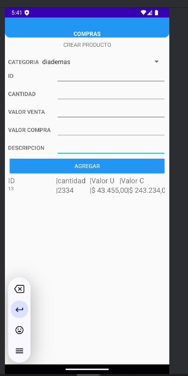
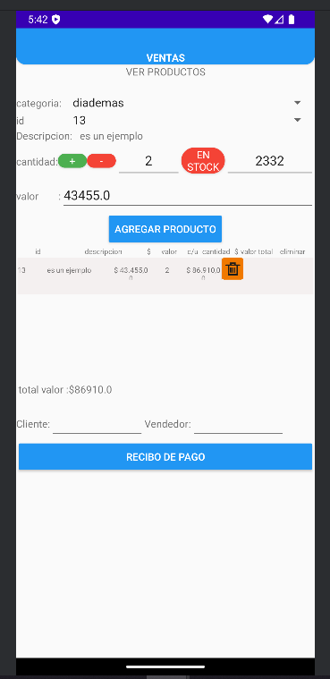
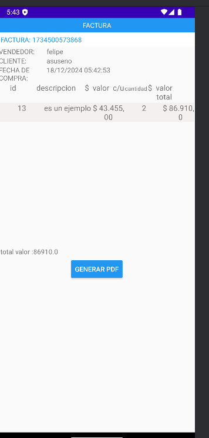
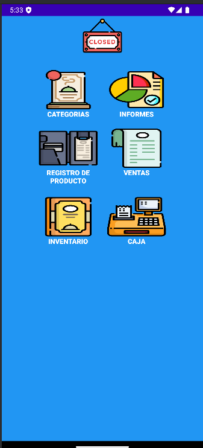
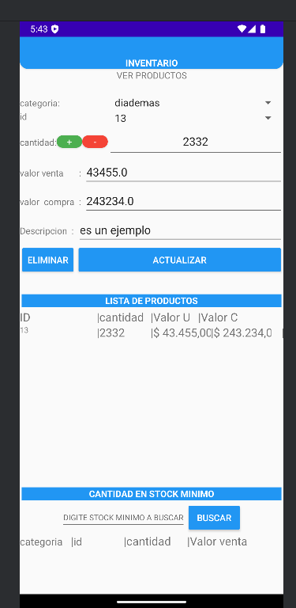
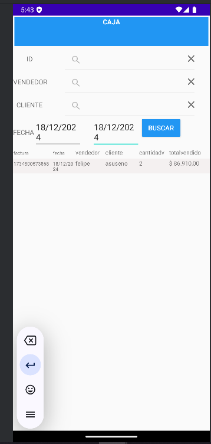

# Inventicare - Sistema de Inventario

**Inventicare** es una aplicación de gestión de inventarios desarrollada en Android Studio utilizando Java y Firebase. Este sistema permite gestionar productos, generar facturas, y realizar ventas, entre otras funcionalidades. A continuación, se describen las características principales del sistema.

## Características

- **Gestión de Categorías**: Permite organizar los productos en diferentes categorías.
- **Creación de Productos**: Se pueden crear productos con detalles como nombre, cantidad, precio y categoría.
- **Generación de Ventas**: El sistema facilita la creación de ventas, aplicando los productos disponibles y generando facturas.
- **Visualización de Facturas**: Los usuarios pueden ver las facturas generadas con todos los detalles de la venta.
- **Gestión de Inventario**: El sistema permite verificar y actualizar el inventario de productos en tiempo real.

## Funcionalidades

1. **Pantalla de Categorías**
   - Organiza los productos en diferentes categorías para facilitar la búsqueda y gestión.
   

2. **Creación de Producto**
   - Permite crear nuevos productos, asignando detalles como nombre, cantidad y precio.
   

3. **Generación de Venta**
   - Facilita la creación de ventas y la generación de facturas.
   

4. **Factura**
   - Visualización de facturas generadas, incluyendo los detalles de los productos vendidos.
   

5. **Menú Principal**
   - Acceso rápido a las diferentes opciones del sistema: inventario, ventas, categorías, entre otros.
   

6. **Ver Inventario**
   - Visualiza el inventario actual de productos, con la opción de actualizarlo.
   

7. **Pantalla de Facturas**
   - Muestra una lista de todas las facturas generadas.
   

## Tecnologías

- **Android Studio**: Para el desarrollo de la aplicación móvil.
- **Java**: Lenguaje de programación utilizado para la lógica de la aplicación.
- **Firebase**: Utilizado para la autenticación, base de datos en tiempo real y almacenamiento.

## Requisitos

- Android Studio 4.1 o superior.
- Conexión a internet para Firebase.
- Cuenta de Firebase para configurar el proyecto.

## Instalación

1. Clona este repositorio en tu máquina local:
   PROYECTO PRIVADO
